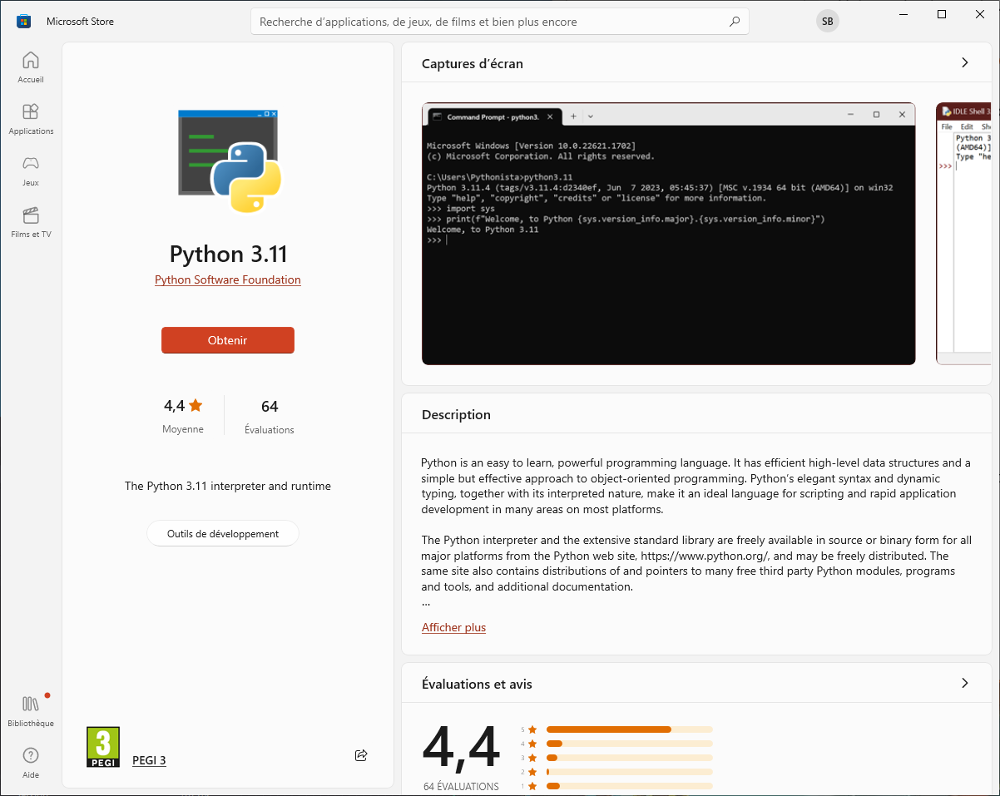
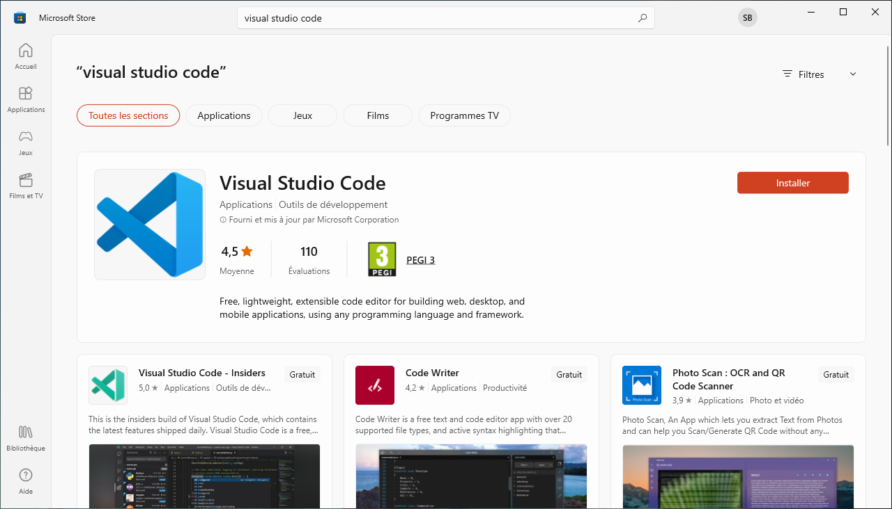
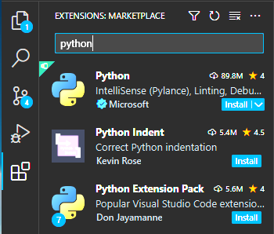
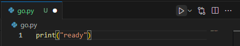

# bienvenue à Happy Town

Ceci est le point de départ de votre formation d'initiation à la programmation en utilisant le langage *Python*. Apprendre à programmer, c'est comme debarquer à un nouvel endroit et se faire de nouveaux amis.


## installations

### installation de Python

Sous Windows 10+, Python est disponible dans le *Microsoft Store*, pret à être installé.

Dans le menu démarrer, rechercher "python" ou "store" puis "python". Lancer l'installation.

Lancer l'installation.




### installation de Visual Studio Code

Nous allons employé un éditeur de texte spécialisé pour coder : *Visual Studio Code* - ou pour faire court *Code*. Sous Windows 10+, Code est disponible dans le Microsoft Store, pret à être installé.

Dans le store, recherchez "Visual Studio Code". Lancer l'installation.




### installation des extensions

Lancer Code.

Nous allons utiliser des extensions de Code pour faciliter la programmation en Python.

Trouver l'icone extensions, rechercher "python" et installer le premier resultat, packagé par *Microsoft*.




### vérifier les installations

à ce stade, Code devrait afficher ceci :


cliquer le bouton "Create Python File"

dans la fenetre de texte qui s'ouvre, écrire :
```python
print("ready")
```

puis lancer l'execution de ce premier code en python en cliquant sur l'icone de lecture :



Code devrait ouvrir un terminal affichant le lancement de python sur le fichier et le resultat de son execution - afficher "ready" :
```
PS C:\Users\...\HappyTown> &
C:/Users/.../AppData/Local/Microsoft/WindowsApps/python3.11.exe c:/Users/.../HappyTown/go.py
ready
```


### Un problème ? 

peut-être faut il contourner un proxy !

```
PS C:\Users\...\HappyTown> &
pip config set global.proxy http://mon.proxy.à.moi.que.j.ai
```


### Voilà ! c'est pret !!

## [Commencer le voyage...](HappyTown.ipynb)
