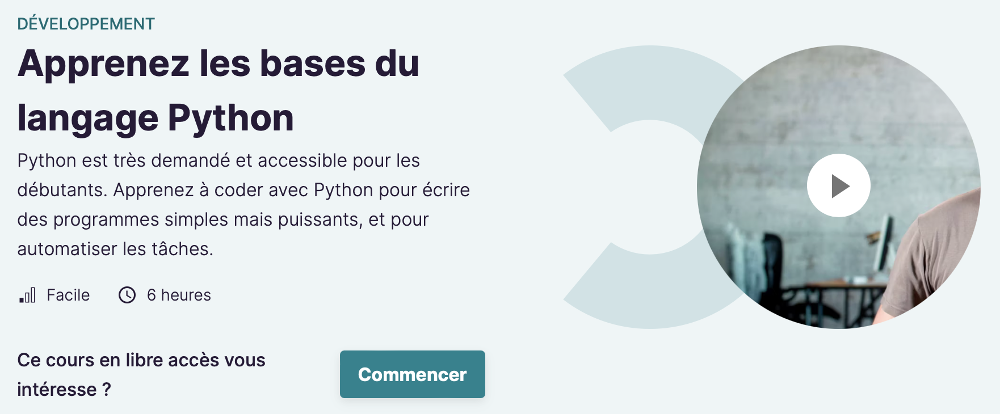
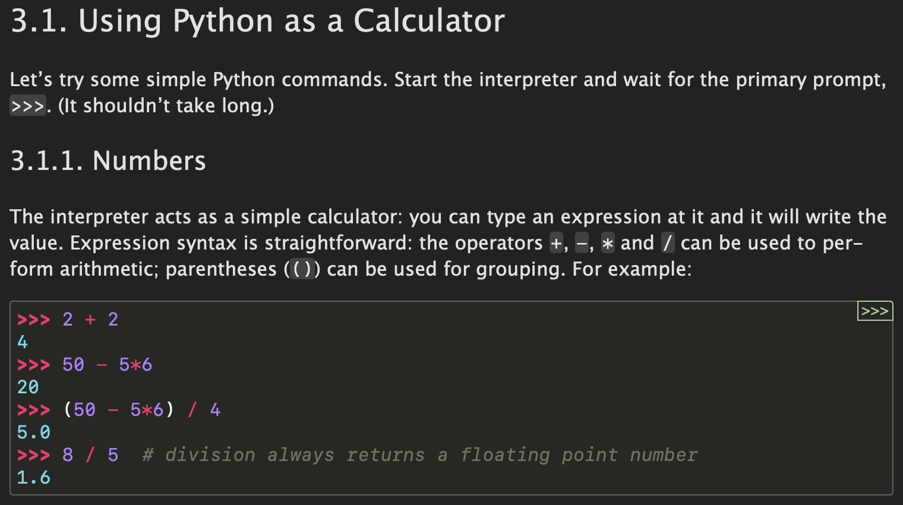

# pour aller plus loin

## des cours en vidéo

### cours en français sur Open Class Rooms

https://openclassrooms.com/fr/courses/7168871-apprenez-les-bases-du-langage-python/

### cours en anglais sur Free Code Camp

https://www.freecodecamp.org/news/learn-python-from-harvard-university/

## quizz sur W3School

https://www.w3schools.com/python/exercise.asp

## des exercices sur CodeWars Python 8kyu

https://www.codewars.com/kata/search/python?q=&r%5B%5D=-8&tags=Fundamentals&xids=played&beta=false&order_by=total_completed%20desc

## des anti-sèches sur la syntaxe

- https://learnxinyminutes.com/docs/fr-fr/python-fr/
- https://docs.python-guide.org/writing/style/

## des tutos et des cours interactifs

### w3schools

https://www.w3schools.com/python/default.asp

### le tuto officiel

https://docs.python.org/3/tutorial/index.html

### pyFlo

https://pyflo.net/

### d'autres resources

- https://apprendrepython.com
- https://realpython.com/python-first-steps/
- https://www.kaggle.com/learn/python

## la documentation officielle

https://docs.python.org/3/library/index.html

## livre de programmation plus avancée

### Problem Solving with Algorithms and Data Structures using Python

https://runestone.academy/ns/books/published/pythonds/index.html